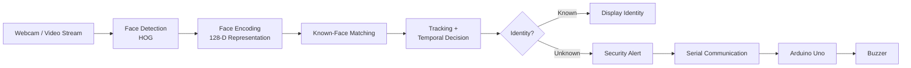

# Real-Time Security Screening System

> A portfolio-safe documentation repository for a six-member academic project combining computer vision, real-time face recognition, tracking, and embedded alerting.

[](https://www.python.org/)
[](https://opencv.org/)
[](https://www.arduino.cc/)
[](#project-context)

## Overview

The **Real-Time Security Screening System** is an academic security-monitoring prototype that combines a camera-based computer-vision pipeline with an embedded alert mechanism.

The system detects faces from a live video stream, generates facial representations, compares them against registered identities, maintains recognition decisions over time, and can trigger a hardware alert when an unknown person is detected.

The project explores the integration of **computer vision, machine learning inference, real-time processing, Python software architecture, serial communication, and embedded hardware** in a single security-oriented system.

## System Architecture



## Key Technical Areas

| Area | Technologies / Concepts |
|---|---|
| Computer vision | OpenCV, live video processing |
| Face detection | HOG-based detection |
| Face recognition | `face_recognition`, dlib-based 128-D face encodings |
| Real-time processing | Worker thread, frame queue, asynchronous processing |
| Tracking | Face tracking across video frames |
| Decision logic | Recognition history / temporal voting |
| Security response | Unknown-person detection and alert generation |
| Embedded integration | Arduino Uno + serial communication + buzzer |
| Software structure | Modular Python components and configuration |

## Project Context

This was developed as a **six-member academic group project**.

This public repository is intentionally maintained as an **individual portfolio/documentation repository**. The original team source code, private datasets, personal identity data, and other group-owned project files are **not published here**.

That separation preserves the collaborative nature of the original project while still documenting the engineering problem, architecture, technologies, workflow, and learning outcomes relevant to my portfolio.

## My Engineering Focus

My portfolio interest is centered on **ECE, embedded systems, digital hardware, VLSI, and hardware/software integration**. This project is particularly valuable in that context because it connects a software-heavy computer-vision pipeline to a physical embedded response.

My documented learning focus from this project includes:

- understanding an end-to-end real-time security pipeline;
- integrating Python software with embedded hardware;
- working with serial communication between a host computer and Arduino;
- understanding how recognition decisions can be stabilized using temporal information;
- organizing a multi-module real-time application;
- considering practical issues such as latency, false detections, unknown-person handling, and system response.

> **Note:** This section intentionally describes the engineering focus without claiming that every software module in the original group implementation was individually authored by me.

## Software Pipeline

1. Capture frames from the camera.
2. Detect faces in the incoming frames.
3. Generate a numerical face representation for each detected face.
4. Compare representations with registered identities.
5. Track detected faces and retain recognition history.
6. Use temporal information to reduce unstable frame-to-frame decisions.
7. Display the current recognition result.
8. Capture or record an unknown-person event where configured.
9. Send an alert command through serial communication.
10. Drive the Arduino-connected buzzer for a physical warning.

## Representative Module Structure

The original implementation was organized around modules with responsibilities such as:

```text
main.py                 Application entry point / orchestration
registration.py         Known-face registration workflow
face_utils.py           Face-processing utilities
recognition_worker.py   Recognition processing worker
tracker.py              Face tracking / temporal state
alerts.py               Alert and serial-handling logic
config.py               Runtime configuration
```

These filenames are documented here as an architectural reference; the original source implementation is intentionally not included in this public portfolio repository.

## Design Considerations

### Real-time processing

A camera continuously produces frames, while face detection and recognition can be computationally expensive. Separating recognition work from the main capture/display path helps the application remain responsive.

### Temporal stability

A single frame can produce an unreliable recognition result. Tracking and history-based voting provide a temporal layer so that decisions are not based solely on one instantaneous frame.

### Unknown-person handling

The system treats an unmatched face as a security event rather than merely displaying a failed recognition result. This creates a bridge between computer-vision inference and a physical security response.

### Hardware/software boundary

The host computer performs the computationally intensive vision work, while the Arduino acts as a lightweight embedded alert controller. Serial communication forms the interface between these two domains.

## Limitations

This prototype is an academic demonstration rather than a production security system. Real deployments would require substantially stronger validation, including:

- controlled and uncontrolled lighting evaluation;
- larger and more diverse datasets;
- spoofing / presentation-attack protection;
- stronger identity and privacy controls;
- quantified false-accept and false-reject rates;
- latency and throughput benchmarking;
- secure handling of stored biometric information;
- fail-safe hardware behavior.

## Repository Scope

```text
Real-Time-Security-Screening-System/
├── README.md
├── docs/
│   ├── system-architecture.md
│   ├── software-pipeline.md
│   ├── hardware-integration.md
│   ├── face-recognition.md
│   └── project-contribution.md
├── architecture/
│   └── README.md
├── results/
│   └── README.md
└── references/
    └── README.md
```

## Why This Project Matters to My Portfolio

This project represents an early step toward the broader **hardware + software + intelligent systems** direction of my ECE portfolio. It complements later work involving Verilog, FPGA/RTL design, SoC interfaces, and Network-on-Chip architectures by demonstrating experience at a different layer of the engineering stack.

## Academic Project

**Type:** Second-year academic group project  
**Team size:** 6  
**Domain:** Security Systems · Computer Vision · Embedded Systems  
**Repository purpose:** Individual portfolio documentation

---

### Portfolio note

The repository documents the project and its engineering concepts without redistributing the complete team implementation. Any future additions should continue to respect the ownership, privacy, and academic requirements of the original group project.
